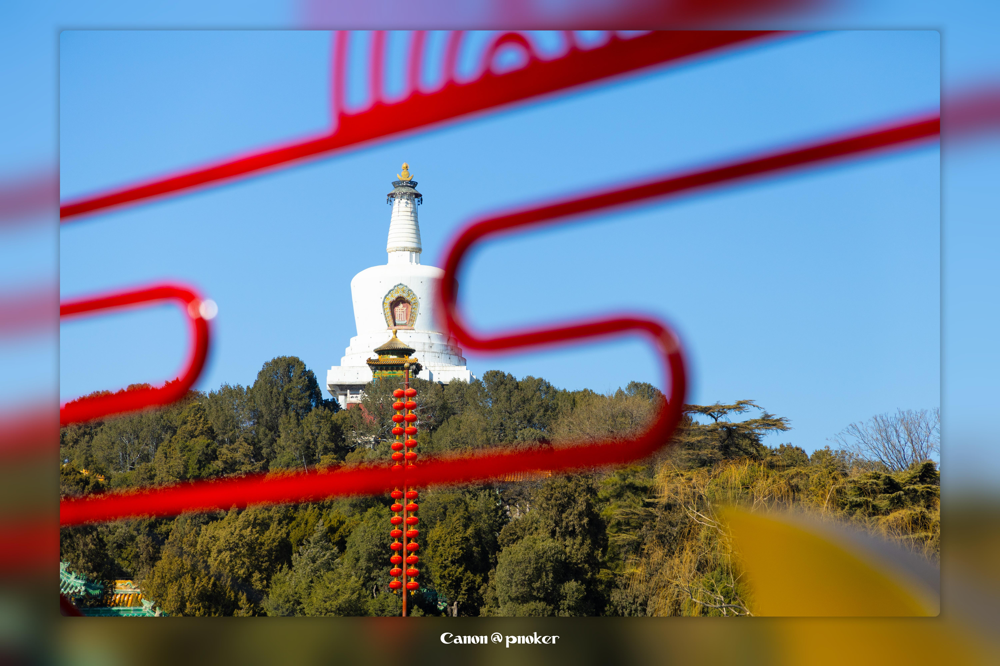
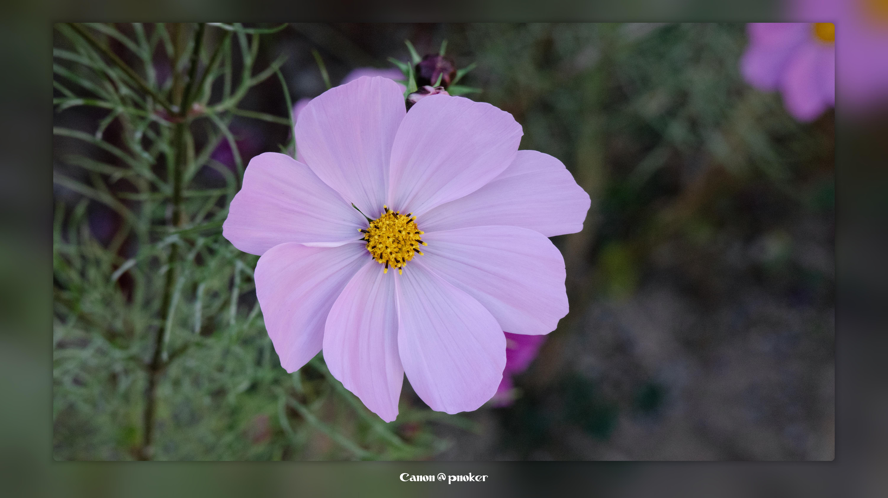

# The Lightning-Fast Image Enhancer: Effortlessly Add Premium Shadow Borders!

This Python-powered tool is designed to add premium shadow borders to your images.
It works at lightning speed, getting the job done in a flash.
Plug-and-play simplicity means even your cat could use it! Plus, it supports batch processing, making it a breeze to handle large numbers of images.
Whether you’re looking to enhance image quality or save time, this tool is your go-to solution for stunning results.

# Demo

